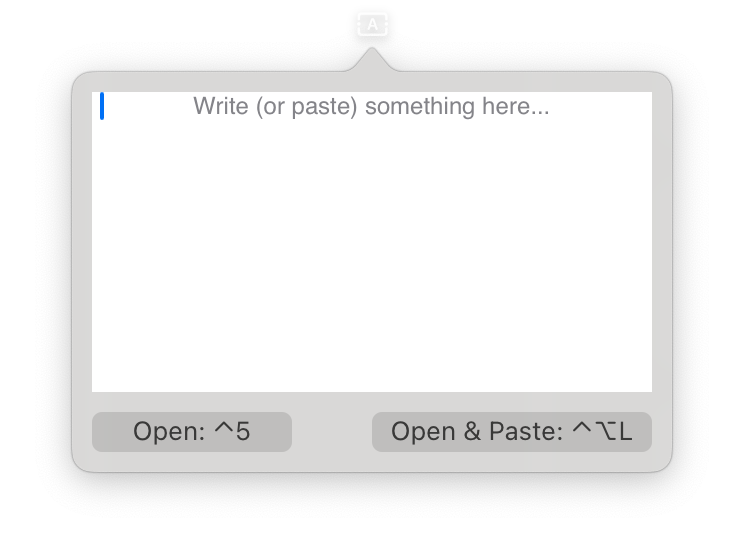

# scratcher

inspired by a recent [post about a textarea widget for kde plasma](https://fosstodon.org/@dcz/115337121728745671), this is a widget like that, but for macOS!

## features

- text area for all your text area needs
- scrollable!
- keybinds!! just open it, or open & paste the text from clipboard.

## default keybinds

- to open: <kbd>⌃⌥K</kbd>
- to open & paste whatever's in your clipboard: <kbd>⌃⌥L</kbd>

changeable via the UI!

## screenshot

## building

[a script](./build.sh) is provided to build the app into a plain binary. TODO: make .app package

## license

[MIT](./license.txt)
